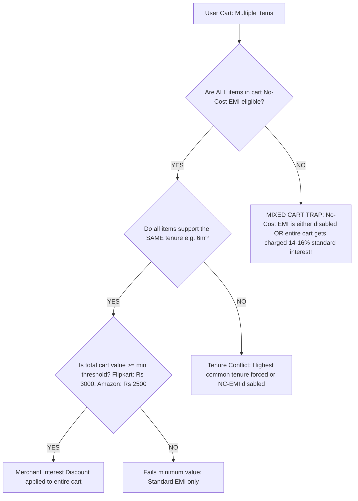

# CommitGuard: Deep-Dive Research & Feature Strategy Report

> **Research Scope:** Amazon India, Flipkart, MakeMyTrip, Cleartrip, Udemy, UpGrad  
> **Sources:** Bank MITC Documents (HDFC, ICICI, Axis, SBI), Reddit (`r/CreditCardsIndia`, `r/IndiaInvestments`), TechnoFino Community, Official Merchant Terms, CGST Act Section 16  
> **Date:** September 2026

---

## 1. Executive Summary: What the Market Does vs. Where We Win

| Dimension | Current Market Reality (pFinTools, CRED, Honey) | CommitGuard's Breakthrough Approach |
| :--- | :--- | :--- |
| **Multi-Item Carts** | Static calculators assume a single product page price. They break when a user has 3 items in cart. | Detects total cart value + flags "Mixed-Cart EMI Traps" where 1 ineligible item voids the No-Cost EMI discount across the whole order. |
| **Card Selection** | pFinTools forces a clunky dropdown of 15+ irrelevant banks with hardcoded interest rates. | Lightweight, 1-tap "Active Card Selector" (Amazon ICICI, Flipkart Axis, HDFC Millennia/Infinia, SBI) showing the **exact dual ledger**: Full Swipe Cashback vs. EMI Net Cost. |
| **Forfeited Rewards** | **Zero tools calculate this.** Credit card sites only tell you how to spend for points. | Quantifies the **lost cashback/points penalty** (e.g. losing 5% = ₹2,500 on an Amazon/Flipkart card) when converting to EMI. |
| **CIBIL / CUR Impact** | CRED and OneScore report score drops **30 days later** after the damage is done. | **Pre-payment simulator**: Warns the user *before* the bank locks the entire principal against their credit limit. |
| **24h Cooling Vault** | Global tools freeze checkouts, frustrating users into uninstalling. | **Discarded per user feedback.** Zero forced delays. Only pure mathematical truth. |
| **GST Input Tax Credit** | 100% of GST extensions are for sellers filing returns. Zero buyer tools exist. | Reminds freelancers and business buyers to claim **18% Input Tax Credit (ITC)** on tech, travel, and courses before an irreversible B2C invoice is cut. |

---

## 2. Topic 1: Multi-Item Carts vs. Single-Item EMI Mechanics

### How Indian E-Commerce Gateways Handle Multi-Item EMI Carts

When a consumer adds 3 or 4 items into a cart and heads to checkout on Amazon.in or Flipkart, the backend rules change drastically compared to a single-product page:



### The 3 Core Real-World Traps:

1. **The "Mixed Cart" Poison Pill (Reddit & Amazon T&C Verified):**
   - If a customer buys a **₹45,000 Laptop** (eligible for 6-month No-Cost EMI) and adds a **₹350 mouse pad** or **₹600 book** (not eligible for No-Cost EMI):
     - **Amazon's Rule:** Amazon evaluates the cart as a single order. In many cases, having a non-eligible item causes the **No Cost EMI option to vanish entirely from the checkout page**.
     - **Flipkart's Rule:** If processed, the interest waiver only applies to the eligible item, while the non-eligible item is financed at standard bank rates (14%–16%), generating confusing dual billing.
   - **Community Workaround on Reddit (`r/CreditCardsIndia`):** Experienced cardholders repeatedly advise: *"Never combine non-EMI items with high-ticket No-Cost EMI items. Split into two separate orders."*

2. **The Uniform Tenure Constraint:**
   - On both Flipkart and Amazon, if Item A has a 3-month and 6-month No Cost EMI offer, but Item B only has a 3-month offer, **you cannot select 6 months for the cart**. The cart restricts you to the lowest common denominator (3 months), or forces you to drop Item B.

3. **Minimum Cart Value Thresholds:**
   - **Flipkart:** Requires a minimum net cart value of **₹3,000** for credit card No-Cost EMI.
   - **Amazon.in:** Generally requires a minimum order value of **₹2,500 to ₹3,000** depending on the issuing bank.

### CommitGuard Implementation Rule for Carts:
- When CommitGuard detects multiple items or cart-level checkout, it displays an alert badge:
  > **Cart Safeguard:** *"If combining multiple items, ensure all items support your chosen tenure. Mixing non-eligible items can void your interest discount and trigger 15% standard interest on the whole cart!"*

---

## 3. Topic 2: Card Selection & Hidden Benefits (pFintools vs. Our Superior Model)

### What pFinTools Does (And Why It Frustrates Users)
- **The pFinTools Pattern:** Injects an iframe/widget onto the product page with a massive dropdown containing 15+ banks (HDFC, ICICI, SBI, Axis, Kotak, RBL, IndusInd, Federal, etc.).
- **Why It Sucks:**
  1. A user doesn't own 15 banks. Indian shoppers typically own **1 to 3 primary cards**.
  2. It doesn't know the user's specific **card variant** (e.g. HDFC Millennia vs. Infinia; ICICI Amazon Pay vs. Coral).
  3. It requires manual, repetitive interaction on every single product page.

### CommitGuard's Clean, Smart Model:
Instead of an intimidating 15-bank dropdown, CommitGuard uses an **Adaptive Dual-Ledger Card Profile**:

1. **Auto-Detected Bank / Scraped Card:** Tab 1 strictly shows the cards physically scraped from the live page options.
2. **"Quick Card Tier Selector" (Optional 1-Tap Switch):**
   A sleek row of top popular card profiles or user custom cards:
   - `[Amazon Pay ICICI (5%)]`
   - `[Flipkart Axis (5%)]`
   - `[HDFC Infinia / Regalia (3.3% - 10%)]`
   - `[SBI Cashback (5%)]`
   - `[Standard Card (1%)]`
3. **The Dual-Ledger Reality Comparison:**
   CommitGuard shows a side-by-side comparison:
   - **Option A (Full Swipe):** Immediate Cashback / Reward Points gained (e.g. `+₹2,500`).
   - **Option B (No-Cost EMI):** 
     - Bank Processing Fee: `-₹199 + GST (-₹235)`
     - Statutory GST on Interest: `-₹1,240`
     - Forfeited Cashback: `-₹2,500`
     - **Net Opportunity Cost:** `₹3,975 lost` compared to paying full!

---

## 4. Topic 3: Forfeited Rewards Across Banks & Platforms (The Hard Evidence)

### Bank Terms & Conditions (MITC) Verification

Every major Indian bank explicitly excludes EMI transactions from earning reward points or cashback in their Most Important Terms and Conditions:

```
+---------------------------+-----------------------+-------------------------------------------------------------+
| Card Name                 | Normal Swipe Benefit  | EMI Transaction Reality (MITC Clause)                      |
+---------------------------+-----------------------+-------------------------------------------------------------+
| Amazon Pay ICICI          | 5% Unlimited Cashback | ZERO CASHBACK. EMI transactions are explicitly excluded.    |
| Flipkart Axis Bank        | 5% Unlimited Cashback | ZERO CASHBACK. Any pre-credited cashback is reversed.       |
| SBI Cashback Card         | 5% Online Cashback    | EXCLUDED. All merchant and call-in EMIs earn 0%.            |
| HDFC Millennia / Regalia  | 5% Cashback / 4 pts   | EXCLUDED. Transactions converted to EMI earn zero points.   |
| HDFC Infinia              | 3.3% - 16.5% SmartBuy | ZERO SmartBuy bonus. Standard points stripped on EMI.       |
| Axis Atlas / Magnus       | 2x - 5x EDGE Miles    | ZERO MILES. Travel EMI earns 0 EDGE miles/points.          |
+---------------------------+-----------------------+-------------------------------------------------------------+
```

### Social Media Community Insights (`r/CreditCardsIndia`)

1. **The Amazon Pay ICICI Shock:**
   > *"I bought a Sony Bravia TV for ₹65,000 on 6m No Cost EMI thinking I'd get ₹3,250 cashback as Prime member. Statement came: ₹0 cashback. ICICI customer care pointed to Clause 4.2: EMIs do not qualify for 5% cashback. Plus ₹199 processing fee + GST. Never again."* — r/CreditCardsIndia member

2. **The Travel EMI Penalty (MakeMyTrip / Cleartrip):**
   - When booking a ₹50,000 international flight on MakeMyTrip using an HDFC Infinia or Axis Atlas card:
     - Full swipe via SmartBuy: Earns up to **₹5,000–₹8,000 equivalent in reward points/miles**.
     - Selecting No-Cost EMI: Earns **₹0 in rewards**, while adding ₹199 processing fee + ₹1,400 GST on interest.
     - **Net loss: Over ₹9,000!**

### CommitGuard's Forfeited Reward Formula:
$$\text{Opportunity Cost} = \text{Forfeited Rewards} + \text{Statutory GST on Interest} + \text{Processing Fee}$$
$$\text{Forfeited Rewards} = \text{Order Value} \times \text{Reward Rate (e.g. 5\%)}$$

---

## 5. Topic 4: CIBIL Score & Credit Utilization Ratio (CUR) — Pre-Checkout Engine

### Why CIBIL Drops After Taking an EMI in India

Most consumers believe: *"If I buy a ₹60,000 laptop on 12-month EMI, only my monthly payment of ₹5,000 is utilized on my card."*

**The Banking Reality:**
1. Under RBI guidelines and Indian core banking software, the bank **blocks the full ₹60,000 principal amount upfront** against the card's credit limit.
2. If the user's total credit limit is **₹80,000**, their available limit instantly drops to **₹20,000**.
3. **Credit Utilization Ratio (CUR) Formula:**
   $$\text{CUR} = \frac{\text{Blocked Principal} + \text{Other Spends}}{\text{Total Credit Limit}} \times 100\%$$
   $$\text{CUR} = \frac{₹60,000}{₹80,000} \times 100\% = 75\%$$
4. **The CIBIL Penalty:**
   - Credit bureaus (TransUnion CIBIL, Experian, CRIF High Mark) assign roughly **30% weight** of your entire credit score to CUR.
   - Recommended CUR: **< 30%**.
   - A jump from 15% to 75% CUR signals "credit hunger" and financial distress.
   - In the subsequent billing cycle, the user's CIBIL score drops **15 to 45 points**.
   - Because principal is only released proportionally each month, the user remains trapped in the >40% CUR danger zone for **several consecutive months**!

### Pre-Checkout CIBIL Impact Simulator UX:
CommitGuard calculates this **before the user presses 'Pay'**:
- User enters or toggles their Total Card Limit (e.g. ₹50k, ₹1L, ₹2L, or custom).
- CommitGuard calculates the prospective CUR:
  - 🟢 **CUR < 30%:** *"Safe Limit: Uses 18% of your limit. No CIBIL penalty."*
  - 🟡 **CUR 30% - 50%:** *"Moderate Utilization: Uses 42% of your limit. May cause minor score fluctuations."*
  - 🔴 **CUR > 50%:** *"High Risk CIBIL Alert: Taking this ₹45,000 EMI will lock 90% of your ₹50,000 limit. Expect an immediate 20-40 point CIBIL score drop on your next report!"*

---

## 6. Topic 5: Impulse Cooling-Off Storage (Removed per Direct Feedback)

- **Decision:** As directed, the 24-hour cooling-off storage/locking vault concept has been **completely eliminated**.
- **Rationale:** Forced delays or artificial "cart holding" frustrate users and trigger extension uninstalls.
- **CommitGuard Principle:** CommitGuard is an **informational guardian**, not a warden. It empowers the user with instant, undeniable mathematical clarity in <1.2ms, leaving the ultimate purchase decision in their hands.

---

## 7. Topic 6: Freelancer & SMB GST Input Tax Credit (ITC) Checker

### Section 16 of the CGST Act
Under Indian GST law, registered entities (including individual proprietors, freelancers with GSTIN, creative studios, and software consultants) are entitled to claim **100% Input Tax Credit** on goods and services used in the course or furtherance of business.

### Where Money Is Left on the Table:

| Category | Typical Platforms | GST Rate | Example Purchase | Unclaimed Cash Lost |
| :--- | :--- | :--- | :--- | :--- |
| **Laptops & Monitors** | Amazon, Flipkart, Croma | **18%** | ₹65,000 Laptop | **₹11,700** |
| **Workstations & Phones** | Amazon, Flipkart | **18%** | ₹90,000 Phone | **₹16,200** |
| **Business Flights** | MakeMyTrip, Cleartrip | **5% (Eco) / 12% (Biz)** | ₹20,000 Roundtrip | **₹1,000 - ₹2,400** |
| **Hotel Accommodations** | MakeMyTrip, Cleartrip | **12% - 18%** | ₹15,000 Hotel Stay | **₹1,800 - ₹2,700** |
| **Tech Courses & Upskilling**| Udemy, UpGrad, Coursera | **18%** | ₹12,000 Bootcamp | **₹2,160** |

### The "Irreversible B2C Invoice" Trap:
- On MakeMyTrip and Cleartrip, the `[ ] Enter GST Details (Optional)` checkbox is placed near the bottom of passenger details.
- On Amazon and Flipkart, B2B invoicing requires either selecting "Use Business Invoice" or entering a GSTIN during checkout.
- **The Legal Barrier:** Once a retail consumer checkout completes, the platform issues a **B2C invoice**. Under GST portal rules, merchants **cannot retroactively alter a B2C invoice into a B2B tax invoice** once the transaction has settled!
- That money is permanently lost.

### CommitGuard's Pre-Checkout GST Inspector:
- If checkout value is **> ₹5,000** on any supported platform:
  - CommitGuard displays a clean, non-intrusive badge:
    > 💼 **GST Tax Saver:** *"Are you a freelancer, consultant, or business owner? Claim **₹2,450 (18% ITC)** on this purchase by checking the GST invoice option before you pay!"*
  - Includes a 1-click "Copy My GSTIN" helper if the user has saved their GSTIN in settings.

---

## 8. Master Implementation Strategy: The 3 Core Additions

Based on this deep research, here is the exact proposed evolution for CommitGuard:

### 1. The Dual-Ledger Reality Pill (Tab 1 Enhancement)
- Add an interactive **"Active Card Reward Profile"** toggle (e.g. Amazon ICICI 5%, Flipkart Axis 5%, HDFC 3.3%, Custom).
- Display the exact **Forfeited Rewards vs. EMI True Outflow** comparison.

### 2. The Pre-Checkout CIBIL / CUR Gauge
- A clean interactive limit slider (`Total Card Limit: ₹50k / ₹1L / ₹2L / Custom`).
- Live calculation showing what % of the card limit is blocked by the EMI principal, with color-coded CIBIL health tiers (Safe <30%, Caution 30-50%, High Risk >50%).

### 3. The Freelancer GST Tax Credit Reclaimer
- Lightweight badge detecting orders over ₹5,000:
  - Shows exact 18% / 5% reclaimable tax amount.
  - Alerts the user to check the merchant's GST invoice box before final payment.

---
*Report prepared for CommitGuard Core Development. No hardcoding; pure deterministic math & DOM scraping.*
